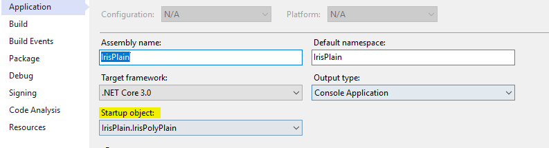

# Laboratory in Secure Computation in the Cloud

##  			Dr. Adi Akavia University of Haifa, Fall 2019

### Privacy-preserving machine learning SVM inference on FHE encrypted data

#### 					Presenting: Savranevski Gal

 

# Introduction

With the popularity of Cloud computing, more and more user’s data are stored on Cloud servers. 

Cloud servers also provide computation power services. This raises concerns about privacy. 

The traditional encryption schemes do not allow running any computation on encrypted data. 

So, we need to choose between storing our data encrypted in the cloud and downloading it to perform any useful operations or providing the decryption key to service providers which risks our privacy.

Homomorphic encryption can solve this problem. If the user encrypts the data using homomorphic encryption, the Cloud can perform meaningful computation on the encrypted data in order to provide services to users without revealing the user’s privacy.

Machine learning algorithms are being more and more popular and efficient, but for training and making predictions, one need to share his data. In many cases this data is private, for example a hospital wants to predict whether a patient is at hurt attack risk group. For model training the hospital need to share many patient’s medical data, and for prediction the patient his person data. Another example is a business company with a commercial data, that wants to train a machine learning model and then use it to predict some desired events.

Privacy-preserving machine learning enables secure outsourcing of machine learning tasks to an untrusted service provider (server) while preserving the privacy of the user’s data (client). Attaining good concrete efficiency for complicated machine learning tasks, such as support vector machine (SVM), is one of the challenges in this area

[Microsoft’s Simple Encrypted Arithmetic Library](https://www.microsoft.com/en-us/research/project/microsoft-seal/) (SEAL ) is a free and open-source cross platform software library developed by Microsoft Research that implements various forms of homomorphic encryption.

This project task was to train SVM model on plaintext data, design an arithmetic circuit for SVM inference, implement secure inference on encrypted data using SEAL.

Main contribution of my work is a generalized high-performance concept implementation of the SVM algorithm which suitable for all SVM models with linear and polynomial kernels.

Two SIMD technics are shown and implemented in my work; these technics can be used stand alone in various other SEAL applications. 

The first is a technic for SIMD inner product implementation.

Second technic is embedding many samples into one cipher text to simultaneously calculating many predictions.

I show a model where the SVM coefficients are used as a plaintext but a simple adoption can be made for an encrypted SVM coefficients.

# Training SVM

I've used 2 datasets in my work :

1. [Iris dataset]( https://archive.ics.uci.edu/ml/datasets/Iris) 
2. [Mushroom dataset](https://archive.ics.uci.edu/ml/datasets/mushroom)

The python code , and data analysis can be found at : jupyter notebooks folder

# Running Laboratory code

## Windows

 Laboratory code comes with a Microsoft Visual Studio 2019 solution file `SecureCloudComputing.sln` that can be used to conveniently build and run the code

#### Platform

The Visual Studio solution `SecureCloudComputing.sln` is configured to build the code for `x64` platforms. Because The `SEALNetNative` project or the .NET wrapper library `SEALNet` can only be built for `x64`.

#### Debug and Release builds

You can easily switch from Visual Studio build configuration menu whether the code should be built in `Debug` mode (no optimizations) or in `Release` mode. Please note that `Debug` mode should not be used except for debugging the code itself, as the performance will be orders of magnitude worse than in `Release` mode.

#### Run the code

To run the code there **must** be a folder : `output`  on drive`c:`  , e.g.  `c:\output`  

For output results files. This path can be changed with OutputDir constant variable.

#### Project

The solution contains the following projects:

- **PlainSVC** : For better understanding and performance comparison I’ve implemented the plain version of SVM which is:

  1.  Initialized with the classification parameters
  2. Run prediction for a given sample
  3. The code also configurability outputs performance data such as
     -  Intermediate and final calculation result to help debugging the secure code
     - Time performance data

  

- **SecureSVC** : Servers code for secure inference on samples , this project is a DLL which can be used with a communication wrapper . In the laboratory code this code is invoked by client , in real life the client will send the algorithm and security parameters to initialize the server , then he can send many samples for inference. The sender will return a ciphertext with the inference results , the client need to decrypt , decode ,and apply the sign function.

-  **SVCUtilities** : A project with common static utility functions used in all projects

- **IrisPlain** : Clients code for Iris datasets <u>plain</u> inference .

  - There are 2 files : IrisLinearPlain - linear svm kernel , IrisPolyPlain - polynomial svm kernel.

  - In order to choose which kernel to run please choose via : 

    Properties -> Application -> Strartup object

    

- **IrisSecured** : Clients code for Iris datasets <u>secured</u>  SIMD high performance inference

  - There are 2 files : IrisLinearSecured - linear svm kernel , IrisPolySecured - polynomial svm kernel.

- **MushroomPlain** :  Clients code for Mushroom datasets <u>plain</u> inference

- **MushroomSecure** : Clients code for Mushroom datasets <u>secured</u>  SIMD high performance inference

- **IrisSVMSecured** :The work of implementing secure SVM was iterative from a very custom low performance implementation (of iris dataset), to a generalized secure SVM implementation with powerful batching and high performance. This project contains code for an iterative development .

  - **IrisSimple** : A very customize code for iris dataset only, no loops, custom made data structures (fixed size array), linear kernel only. 

  - **IrisLinear** : Implementation goal was to generalize the simple implementation for running secure svm on any classification dataset ( although the code constructed with Iris training parameters). It used common programing tools such as:  loops, general data structures.

    This implementation handles linear kernel only.

    

  - **IrisLinearBatch , IrisPolyBatch** : Implementation goal was to implement inner product functionality as a SIMD (**Single instruction, multiple data**) operation. Each of the projects implementation is the same , but the kernel is different.

    

For convenience of the setup ,all  relevant project contains the dataset as a resource.
